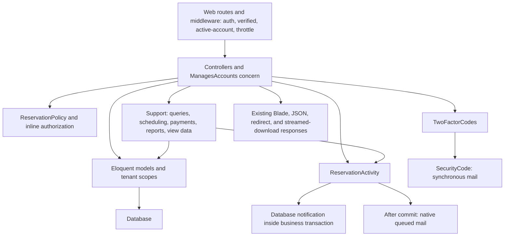

# Phase 4A: Backend architecture preparation and refactoring plan

Date: 2026-10-08 (Asia/Manila)

## Decision and scope

Preparation only. No application code, tests, configuration, routes, schema, business rules, UI, dependencies, or PWA implementation was changed. This report is the only new file. Refactoring must wait for approval of a specific batch.

The recommended approach is small query/validation extractions first, followed by carefully characterized actions that preserve existing transaction ownership. Do not introduce a repository pattern, generic workflow engine, global Super Admin grant, new tenant model, or a blanket conversion to Form Requests. Several controllers and model methods are already appropriately sized.

Git was clean at the start of the inspection. The review used source reads and reflection without bootstrapping the application or accessing its database. No migrations, seeders, queue workers, or test suites were executed in this preparation phase. The last recorded Phase 3B verification was 310 Laravel tests/4,174 assertions, 36 JavaScript tests, 335 browser checks, and 102 frontend equivalence comparisons; those are prior results, not fresh Phase 4A results.

## Inspected inventory and existing architecture

Reviewed every application PHP file in the requested directories: 51 files under `app`, comprising 17 concrete controllers, one empty base controller, one controller concern, eight models, one service, 16 Support classes, one policy, one HTTP middleware, four notification/channel/middleware files, and one provider. Also reviewed both route files, bootstrap wiring, all ten configuration files, 23 migrations, the factory, and seeder.

`app/Http/Requests`, `app/Mail`, `app/Jobs`, `app/Events`, `app/Listeners`, and `app/Observers` do not exist. Their absence does not mean the corresponding functionality is missing: Laravel's native mail messages, registration/verification/password events, and `SendQueuedNotifications` job provide those functions.

Important existing conventions:

- Eloquent relationships, casts, scopes, and fillable/hidden attributes already carry meaningful model behavior.
- Reservation management uses a conventional policy discovered by Laravel. Other permissions remain explicit in controllers/queries.
- Most business and query helpers are static classes in `Support`; `Services` contains only security-code handling.
- `ManagesAccounts` already shares listing, details, and status functionality without duplicating two implementations.
- JSON error rendering is explicitly route-dependent in `bootstrap/app.php`. A generic JSON exception handler would change existing behavior.
- The active-account middleware invalidates inactive authenticated sessions and redirects to login; it does not replace that behavior with a generic JSON 403.
- `AppServiceProvider` retains schema string-length compatibility and configured-origin password-reset URLs. The latter prevents using an untrusted Host header.
- Console scheduling purges expired security challenges hourly with overlap protection. The scaffold `inspire` command is unrelated to business workflows and needs no refactoring.

## Controller-by-controller findings

Counts include named public/protected/private methods. Admin and Resident counts separately identify four imported concern methods. Method sizes include the signature and braces; size indicates inspection priority, not an automatic requirement to refactor.

| Controller | Methods | Largest methods | Overall extraction risk |
| --- | ---: | --- | --- |
| AdminController | 4 direct + 4 concern | concern `index` 33 lines; `store` 32 | Medium |
| AnalyticsController | 1 | `__invoke` 15 | Low; retain |
| AuthController | 5 | `login` 47; `register` 26 | High for workflow; Low for basic input rules |
| DashboardController | 6 | `calendar` 64; `selectedSlot` 43 | Medium |
| EmailVerificationController | 3 | `verify` 18 | High protocol sensitivity; retain orchestration initially |
| FacilityController | 11 | `update` 56; `validatedFacility` 28 | High for CRUD; Medium for file I/O isolation |
| NotificationController | 4 | `scoped`/`index` 13 each | Low; retain |
| OfficialUseController | 7 | `index` 38; `update`/`decision` 25 each | Low query extraction; High mutation extraction |
| PasswordResetController | 4 | `send` 29; `update` 22 | High workflow sensitivity; Low for unchanged input rules |
| PaymentController | 5 | `update` 20 | High mutation sensitivity; already reasonably thin |
| ProfileController | 3 | `update` 38; `updatePassword` 19 | Medium; High if email/security behavior changes |
| ReservationController | 6 | `store`/`editAccepted` 77 each; `accept` 52 | High |
| ReservationPageController | 1 | `index` 58 | Low query extraction; Medium validation changes |
| ResidentController | 1 direct + 4 concern | concern `index` 33 | Medium for permissions; retain concern reuse |
| SecurityController | 6 | `setup` 17 | High protocol sensitivity; retain initially |
| SuperAdminAnalyticsController | 1 | `__invoke` 6 | Low; retain |
| TwoFactorLoginController | 5 | `verify`/`pendingUser` 19 each | High protocol sensitivity; retain initially |
| Base Controller | 0 | Empty framework base | No extraction needed |

### AdminController and ManagesAccounts

Responsibilities: Super Admin-only admin creation/list/details/status management; shared account filtering, sorting, pagination, history, and activation/deactivation. Helpers: `Barangays`, `PhoneNumber`, Eloquent `User`/`Reservation`, and Laravel's `Registered` event.

The concern has four methods: `index` (33), `show` (14), `updateStatus` (14), and `canManageAccounts` (5). It is useful reuse, not duplication to remove. Registration fields repeat AuthController's fields, but the role assignment, session behavior, mail-failure recovery, and responses differ.

Potential extraction: `CreateAdminRequest`, account index filters/query, and eventually a focused account-status action if that operation grows. Do not create a generic registration service that logs Super Admin in as the new account. Keep account-role/tenant lookup before status validation and preserve 404 masking of foreign/incorrect-role IDs.

### AnalyticsController

Responsibilities: role guard, Super Admin redirect, scoped reservation query, and rendering. Helpers: `AdminAnalytics`, `Reservation::inBarangayFor`. No substantial duplicate functionality. The controller is already thin.

Keep it. Any future analytics filter request must preserve the Super Admin redirect before filter validation: `/analytics` currently redirects Super Admin without processing those filters.

### AuthController

Responsibilities: login/register forms, credential validation, inactive-account rejection, password rehashing, session regeneration, pending two-factor binding, registration, recovery from verification-delivery failure, and logout. Helpers: `TwoFactorCodes`, `LoginDestination`, `PhoneNumber`, `Barangays`, Laravel Auth and events.

Input duplication with AdminController is limited to account fields. A `LoginRequest` and `RegisterRequest` are useful early candidates because basic validation currently precedes workflow processing. Keep native authentication and session orchestration initially. Later extraction must preserve when the guard is authenticated, which input is flashed, ten-minute pending sessions, and account creation surviving verification-mail failure.

### DashboardController

Responsibilities: role-dependent operational dashboard versus resident calendar; legacy filter redirects; available barangay/resource choices; month/date/slot selection; shared availability and privacy-specific event details; view data. Helpers: `DashboardOverview`, `FacilityCatalog`, `ReservationAvailability`, `ReservationPeriod`.

Extract a `CalendarPageData` builder after characterization. The distinct-barangay selection query also repeats FacilityController's query, but differs from analytics' represented-barangay definition. Do not merge those definitions indiscriminately.

Potential `CalendarFiltersRequest` is deferred: the controller internally calls `calendar($request)` from `__invoke`, and direct fixtures pass ordinary Requests. A typed replacement would otherwise break that call. Legacy `all` redirects happen before validation and must remain there.

### EmailVerificationController

Responsibilities: notice, consuming a user-bound verification code, `Verified` event, session regeneration, resend, and already-verified redirects. Helpers: `TwoFactorCodes`, `LoginDestination`.

It is small. Retain orchestration. An eventual `VerifyEmailRequest` must preserve the already-verified early return, the explicit string rule, existing error keys, and code/context purpose. Sharing one generic code request with login/setup would change accepted input types and guard timing.

### FacilityController

Responsibilities: browse/detail scope, input validation, combined legacy/new uploads, preflight photo ownership/count checks, upload cleanup, catalog CRUD, and HTML/JSON responses. Helpers: `FacilityCatalog`, `Money`, Storage.

`validatedFacility` already shares store/update rules. `uploadedPhotos`, `storePhotos`, and `deletePhotos` are reasonable candidates for one small `FacilityPhotoStorage` service. Preflight ownership/count checks repeat catalog checks, but the latter occur under a lock; preserve both until explicitly redesigning concurrency handling.

Potential `SaveFacilityRequest` is Medium risk: update currently resolves the scoped facility and returns 404 before input validation. Keep that ordering, combined `photo`/`photos` support, maximum four images, and controller cleanup on thrown exceptions. CRUD/actions are High risk because database transactions and filesystem cleanup are not one atomic operation.

### NotificationController

Responsibilities: notification ownership/type/tenant/event scope, unread count, 20-row pagination, historical wording conversion, open/mark read, and mark-all-read. Helper: `ReservationActivity::forDisplay`.

Repeated calls to the scoped builder correctly apply the same security filter to count/list/open/read-all. The controller is already focused. Keep it; no service or Form Request is justified solely by its size. An optional query extraction must keep own-recipient filtering, resident event exclusions, and 404 behavior.

### OfficialUseController

Responsibilities: management guard, index validation/query/resources, creation, resource transfer/editing, resident conflict preference, transaction boundaries, and notifications. Helper: `OfficialUseScheduling`.

Extract the listing query first. Mutation code mixes different operations; eventually use separate create/update/preference actions while retaining the scheduler. Store/update share `validatedSchedule`, so duplication is already constrained. Repeated role/ownership checks before and after locks protect fresh state and must remain.

Potential requests: index filters first; schedule input and preference requests later. Do not add exists/tenant checks to read filters or normalize nullable defaults without characterization. Mutation requests must preserve scoped-model authorization before validation and fresh-resource checks inside transactions.

### PasswordResetController

Responsibilities: private/no-referrer forms, password-broker calls, secure transport eligibility, neutral reset-link acknowledgment, token cleanup on delivery failure, password/remember-token changes, events, and pending-login cleanup. Helpers: Laravel Password broker, User password cast, logger.

`SendPasswordResetRequest` and `ResetPasswordRequest` can extract unchanged input rules. Keep the broker and explicit neutral responses. Transport checking repeats TwoFactorCodes' security-email policy, but no shared transport abstraction is needed in the first batches. Do not queue secret reset notifications, log token-bearing exceptions, or disclose account existence.

### PaymentController

Responsibilities: payment listing/summary, update authorization/confirmation, reservation-first locking, status action, and exports. Helpers: `PaymentQuery`, `PaymentRecords`, `PaymentReport`.

Already reasonably thin. The best early improvements are validated listing/export requests and smaller report-rendering methods. A future `ChangePaymentStatus` action must preserve reauthorization and confirmation after locks. Do not elevate reporting permission to update permission or move dynamic receipt/refund validation to an earlier Form Request.

### ProfileController

Responsibilities: expired pending-setup session cleanup, security error bag, profile validation, email/2FA interlock, email re-verification, recoverable delivery failure, password confirmation, and flash responses. Helper: `PhoneNumber`; framework hashing/events.

Potential requests: `UpdateProfileRequest`, `UpdatePasswordRequest`, using current rules. Keep the manual password check after new-password validation; replacing it with a built-in `current_password` rule changes validation order/messages. Email-update extraction is later because the user is filled, verification cleared/saved, and notification sent in a specific order.

### ReservationController

Responsibilities: creation/snapshots, acceptance/payment receipt, rejection, accepted reschedule/cancellation/history, legacy total correction, authorization, locks, conflict resolution, and notifications. Helpers: `FacilityCatalog`, `Money`, `OfficialUseScheduling`, `PaymentRecords`, `ReservationAvailability`, `ReservationPeriod`, `ReservationPolicy` via Gate.

Strong candidates for focused actions. Repeated resource lookup/lock and fresh authorization in acceptance/edit are deliberate. History construction resembles Official Use cancellation but has different fields and semantics. Do not unify those cancellation paths yet.

Create, accept, reject, edit, and correction requests require individual timing analysis. In particular, acceptance, rejection confirmation, edit branch fields, and receipt/refund checks cannot simply move ahead of locked state checks. Preserve ordinary-form versus JSON differences and all existing response/flash contracts.

### ReservationPageController

Responsibilities: common filter values, admin validation/query/pagination/last-page recovery, resident ownership/search/sort, and view data. Helper: `AdminReservationQuery`.

The Phase 2 unreachable branches are already removed. Extract the remaining resident listing query if useful. Residents deliberately receive a collection rather than admin pagination and currently do not run the admin validation block. Strict shared filter validation or pagination would be a functional change.

### ResidentController

Responsibilities: role guard, resident-only base query, and regular-admin home-barangay scope, with shared account methods from `ManagesAccounts`. No duplicate independent account CRUD implementation exists.

Keep concern reuse. An account-index request/query may improve organization, but Super Admin resident status updates remain forbidden even though listing/details are system-wide. Preserve role exclusions and foreign-ID 404 behavior.

### SecurityController

Responsibilities: current-password confirmation, setup binding, setup code consumption, resend context, transactional disable, challenge/session cleanup, named error bags, and profile security redirects. Helper: `TwoFactorCodes`.

Methods are individually modest. Keep initially. Eventual requests must retain the `security` bag and validation before already-enabled checks. Disabling also clears challenges/session state when the method is already null; do not add a shortcut that skips cleanup.

### SuperAdminAnalyticsController

Responsibilities: Super Admin guard and delegation to `SuperAdminAnalytics`. Already thin. Keep it. Focus future work on data/query organization only if that becomes meaningful; no action wrapper is needed for six lines.

### TwoFactorLoginController

Responsibilities: pending-user lookup, active/expiry/context checks, consume/login/session regeneration, resend, cancel, and private challenge response. Helpers: `TwoFactorCodes`, `LoginDestination`.

Keep initially. Repeated pending-user resolution is purposeful security reuse. A future login-code request must preserve code validation before pending-user resolution, browser binding, and unauthenticated state until successful consumption. Do not change unsupported-method handling or combine it with email verification's different rules.

### Base controller

The empty base controller is conventional and needs no change. Do not use it to impose a universal role guard, generic response envelope, transaction wrapper, or global Super Admin override.

## Model evaluation

| Model | Existing responsibility worth retaining | Preservation concern |
| --- | --- | --- |
| User | auth/verification contract, hashed password cast, active flag, hidden secrets/phone, phone setter, verification notification bridge | The framework calls its verification hook; do not remove it or add protected security fields to fillable |
| Reservation | relationships, legacy/resource scopes, owning-barangay resolution, period/duration/price, `total` compatibility accessor | `total` also represents SQL aggregate counts when selected as an alias; preserve that distinction |
| Payment | payment relationship, scope through reservation, decimal/history casts, legal transition table | Payment status is independent of reservation status; amount is historical |
| Facility | gallery/reservation/Official Use relationships, rate cast, reservation-access predicate | Predicate tests access/home barangay, not resident role; keep that current behavior |
| FacilityPhoto | ordered gallery metadata relationship | Keep ID/path/order compatibility and legacy primary-photo support |
| OfficialUse | schedule period, scope, creator/facility/conflict relationships | Scope currently uses stored Official Use barangay; edits update it to new resource owner |
| OfficialUseConflict | resolution labels/scope, history-preserving transition | Same-resolution transitions do nothing, including leaving timestamps unchanged |
| TwoFactorChallenge | internal challenge storage, hidden hashes/destination, encrypted destination, immutable expiry cast | User/purpose uniqueness, UUID identity, no timestamps, and hidden/encrypted fields must remain |

Do not move normal relationships/casts/scopes out of models. Do not introduce observers for explicit workflow notifications, enum casts for legacy status strings, or new entity namespaces that would break serialized jobs/morph types. No schema changes are proposed.

## Support classification and meaningful organization

Primary classifications and optional future ownership:

| Existing class | Primary class of responsibility | Recommendation |
| --- | --- | --- |
| AdminReservationQuery | Query builder | Eligible for `Queries/Reservations`; move only with a useful query/validation batch |
| PaymentQuery | Query builder plus HTTP validation and summaries | Eligible for `Queries/Payments`; separate input validation first, preserve query semantics |
| AnalyticsPeriod | Query/filter value object plus HTTP validation | Keep initially; split validation from range calculation only after alias/early-return tests |
| OfficialUseScheduling | Domain service with schedule queries | Eligible for `Services/OfficialUses`; caller-owned transactions/locks remain explicit |
| PaymentRecords | Domain service | Eligible for `Services/Payments`; no new transaction inside its existing locked caller |
| ReservationAvailability | Domain/read service plus calendar presentation | Keep initially; do not split overnight queries and display calculations in the mutation batches |
| FacilityCatalog | Mixed domain service, query builder, filesystem mapping, view-data helper | Highest Support separation opportunity; split reading/mapping from CRUD incrementally |
| PaymentReport | Reporting/export utility plus row presentation | Keep public facade; extract format-writing methods before considering separate exporters |
| AdminAnalytics | Reporting aggregation and view data | Already shares summary/ranking; optional query/view-data separation later |
| SuperAdminAnalytics | Reporting aggregation and view data | Optional represented-barangay helper; retain separate system-wide semantics |
| DashboardOverview | Presentation/view-data helper with queries | Eligible for `ViewData/Dashboard`; preserve bounded lists and count definitions |
| ReservationPeriod | General/domain scheduling utility: value object | Keep namespace: historical migration imports it; preserve mutable Carbon behavior and timezone |
| Money | General money/validation/formatting utility | Keep; do not replace integer-cent calculation or introduce a money package |
| PhoneNumber | General validation/normalization utility | Keep; already eliminates meaningful duplication |
| Barangays | General catalog/constants | Keep namespace: historical migrations/defaults and registration reference it |
| LoginDestination | HTTP/session navigation utility | Keep; small, reused, and tied to verified/intended-session behavior |

These destinations are organizational options, not a mandate to move all classes. No generic query superclass, repository interface, exporter strategy hierarchy, DTO for every array, or duplicate service facade is necessary. Retain `Support\ReservationPeriod` and `Support\Barangays` while migrations depend on them; fresh installs must not break because an old import disappeared.

`Actions`, `Queries`, and `ViewData` are optional project organization, not directories mandated by Laravel. Framework conventions for controllers, requests, models, policies, and notifications remain the foundation.

## Duplicated code: what to extract and what to preserve

Useful extraction candidates:

- Account field rules shared by resident registration/admin creation, while preserving different authorization and session/event handling.
- Listing filter/sort construction in Official Use and the resident reservation branch.
- Payment listing/export validation, currently centralized inside a query helper.
- Facility photo file I/O in the controller.
- Calendar view-data construction and facility array presentation.
- Three format-rendering branches inside `PaymentReport::download`.
- Represented-barangay union queries in DashboardOverview and SuperAdminAnalytics, if their date/role options remain explicit.

Deliberate differences/repetition to retain:

- Preflight versus locked authorization/availability/photo-limit checks.
- Resource-first locking repeated in acceptance and rescheduling.
- Stored active statuses versus actual occupancy-time checks.
- Creation/acceptance/rescheduling overlap rules, which differ.
- Human cancellation versus automatic Official Use cancellation/history fields.
- Account-home barangay, resource ownership, Official Use stored barangay, and notification snapshot barangay.
- HTML/JSON confirmation differences and stale acceptance behavior.
- Normal queued reservation mail versus immediate security-code/reset mail.

## Business-critical preservation contracts

### Reservation creation

1. Resolve the catalog facility first. Missing facility gives 404; disallowed access gives 403; unavailable facility gives a `reservation` validation error before field validation.
2. Validate `reservation_date` with `date` and `after_or_equal:today`; times with `H:i`; purpose maximum 500; attendees 1 through catalog capacity. Creation's date rule differs from strict rescheduling format and must not be strengthened silently.
3. Equal times are invalid; earlier end time means next day.
4. Inside the transaction, lock Facility, recheck access/status, reject Official Use overlap, then check this user's pending/accepted reservation by **facility ID**.
5. The duplicate guard applies to stored statuses, including accepted records whose event is already past. It is not a future-occupancy check and does not use the legacy `forFacility` fallback.
6. Overlap with an accepted resident reservation is currently permitted as a new request. Do not add that exclusion.
7. Save pending status, resource ownership/identity/location/category snapshots, submitted values, and the locked resource's hourly-rate snapshot. Do not calculate/store total payment here.
8. Notify all admins in the reservation's stored owning barangay with `submitted`, and the requester with `submission_confirmed`, inside the transaction. No active-admin filter or Super Admin recipient is currently added.
9. JSON success is 201 with `success/message`; HTML redirects to dashboard with facility/date and `reservation_status`.

The access predicate does not enforce `role=user`; eligible staff can submit through this backend path. A residents-only role guard would change current behavior.

### Acceptance and rejection

Acceptance: initial policy authorization; lock resource by ID or legacy barangay/slug; reload/lock Reservation; reauthorize. Non-pending JSON requests fail with a `reservation` validation error; ordinary forms return the existing success redirect without further validation or mutation. This is already partly covered by repeat-acceptance tests.

Only after the pending guard, validate recorded total with maximum `9999999999.99` and accepted `payment_confirmed`. Repair a null facility link when possible; check Official Use overlap only if a resource exists; mark accepted; record payment; notify accepted. Acceptance currently does **not** reject overlap with another accepted resident reservation, recheck configured Available status, or impose new date/time rules. Missing legacy resource may be tolerated. Preserve these existing distinctions rather than treating them as missing validation to add during refactoring.

Rejection: initial/fresh policy checks, reservation row lock, pending guard, confirmation required only for JSON requests, rejected status, and one rejected notification. Rejection does not introduce a reason, change totals, delete payments, or use a facility lock.

### Accepted rescheduling and cancellation

Resource lock precedes reservation lock and fresh authorization. Accepted status is checked before action/branch validation.

Reschedule requires strict `Y-m-d`, a non-past date, valid unequal `H:i` times, an existing Available resource, no Official Use overlap, and no overlapping other accepted reservation. Exclude the record itself and include legacy resource matches. Preserve rate, total, payment record, and accepted status. A no-op still appends change history, but only actual date/time change sends a rescheduled notification.

Cancellation requires accepted confirmation, one of `User Requested Cancellation`, `Official Use`, or `Other`, and optional notes up to 1,000 characters. Store cancelled status/reason/notes/time and history; preserve money/payment; resolve conflicts; notify cancellation. It does not record a refund.

Both branches preserve the existing history keys, actor identity, ISO timestamp, before/after fields, and response message/flash behavior. Do not replace this with a generic audit schema.

### Across-midnight scheduling and calendar

`ReservationPeriod` uses `config('app.timezone')`, default Asia/Manila. End earlier than start adds one day; equal is invalid. Overlap uses strict start-before-other-end and end-after-other-start, so adjacent intervals do not conflict. Occupancy is start-inclusive/end-exclusive. Duration is the current integer-minute conversion.

Availability looks back one date to find overnight reservations; legacy matches use null facility ID plus slug/barangay. Accepted reservations block; pending/rejected/cancelled do not. Official Use active/conflict schedules also block. The eight display slots are 08:00–12:00 and 13:00–17:00; actual submissions can use other valid times.

Month/day/event data, continued-day notes, current `in_use` versus `booked`, past-day disabling, and unavailable-resource overrides remain. Calendar resource viewing is shared across barangays; Official Use purpose/status details are exposed only to owning admin/Super Admin. Do not convert shared viewing into management access.

### Official Use and conflicts

Create/update reject equal times and overlapping active/conflict Official Use schedules, with overnight/adjacency support. Official Use is not subject to the resident booking Available-status check. Ownership is the selected resource's barangay; creator is assigned on create and preserved on edit.

Synchronize overlapping pending/accepted reservations, including previous-day and legacy matches. Pending requests become cancelled for Official Use with history/notification and no payment/refund. Accepted records remain accepted with payment intact; create/reopen conflicts and notify each new occurrence. Repeated unresolved overlap preserves the resident preference and does not renotify. Moving away resolves relationships without restoring previously cancelled pending requests.

Preference submission belongs to the reservation owner, requires accepted/unresolved state, and records reschedule or cancellation preference. It does not perform the actual reschedule/cancellation. Switching preference while unresolved is allowed; identical preference is silent. Notify current selected admins via the existing database-only event.

Conflict transitions retain previous resolution/decision/resolution timestamps in history. Same resolution is a no-op. Reopening clears decision/resolution times; resolved occurrences remain in history. Recalculation chooses active/conflict from unresolved accepted conflicts, leaving cancelled Official Use untouched. No new Official Use cancellation endpoint is proposed.

### Payments, refunds, and money

- Acceptance creates a single paid payment when absent, with historical `amount` from reservation total. Existing pending payments transition to paid; existing paid payments remain; closed other statuses reject acceptance. Existing amount is not rewritten.
- Status transitions are pending→pending/paid/cancelled, paid→paid/refunded, and terminal refunded/cancelled→same only. Same-status operations do not append history, increment revision, or notify.
- Changed paid/refunded selections require receipt confirmation after locks. A changed status appends existing history, increments revision, and refund stores actor/time and notifies once.
- Payment edits do not mutate reservation status, schedule, rate, or total; cancellation and refund remain independent.
- Legacy total correction is admin-only, policy-scoped, reservation-locked, and has no accepted-only guard. It changes `total_payment`, not Payment.amount/history. Only changed totals on accepted records notify.
- Reporting/notification financial source is `Reservation.total`/stored `total_payment`, not historical Payment.amount. Preserve nullable historical amounts/rates and distinguish unrecorded from zero.
- Calculated price uses integer cents and half-up rounding of fractional hours: rate cents × duration minutes, rounded at division by 60. Preserve existing validation regex, maxima, decimal casts, strings, and formatting.
- Super Admin payment reporting is read-only, but the existing reservation acceptance policy permits Super Admin acceptance with a recorded total. Do not replace these different permissions with a blanket financial rule.

### Notifications, email, queue, and failure handling

ReservationActivity captures reservation event-time scalar fields; queued mail must not reload later schedule/status/amount as event data. Event names, database payload keys, wording, historical display conversion, and action links remain.

Database notifications occur inside business transactions. Mail alone waits for commit through `QueuedReservationMail`, native `SendQueuedNotifications`, and the configured queue connection. Rolling back a business transaction discards its database changes/notices and pending mail. Enqueue/SMTP failure after commit does not undo the successful reservation/payment or bell notification.

Declaration values remain three tries, 60-second timeout, and 60/300-second backoff. `SanitizeMailFailure` removes provider exception text/chains before worker failure storage/logging. Failed-hook logs remain sanitized. Mail delivery rechecks submitted-admin role/barangay or the requester ID; it currently does not add an active-account filter. Recipient name may be reloaded, while reservation event values remain snapshotted.

`official_use_decision` stays database-only. Other listed reservation/payment events retain their existing database/mail eligibility and no-op conditions.

Security codes are immediate mail, not queued reservation mail. The issue transaction commits the challenge before sending; failure deletes that challenge and returns the existing sanitized validation error. Security code and reset-link delivery permit SMTP, or array transport in testing; log mailers cannot expose secrets. Registration/admin creation/email change keep saved records recoverable after verification-delivery failure.

Do not rename `ReservationActivity` or change its serialized private snapshot fields casually: its class is persisted as database notification type and in queued jobs. Keep `User` morph/model identity stable. No new custom job/mail class is required.

### Authentication and security codes

Keep session authentication, hashed password casts, active checks, verification middleware, all throttle limits, and logout invalidation/token regeneration.

Login validates credentials, rejects inactive users, rehashes if required, regenerates the session, and either logs in or stores a browser-bound pending two-factor attempt without authenticating. Context includes user ID, password, email, two-factor method, and verification timestamp; do not expand/rename it silently.

Challenges are user/purpose unique, hashed, destination-encrypted, and five-minute-lived; pending login/setup sessions have ten-minute bounds. Send limits are shared per user: one/minute and five/15 minutes; guess limits are five per challenge and ten/five minutes per user. Preserve counter keys, checks, updates, replacement, invalidation, and single-use consumption order.

Email verification uses `verify`, setup uses `setup`, login uses `login`; browser binding/context differ. Verification is skipped when already verified. Login/setup code rules currently differ from email verification's explicit string rule. Preserve the `security` bag for setup/disable, default bags elsewhere, and secret non-flashing.

Password reset uses the native 60-minute/60-second-throttled broker, neutral acknowledgment, configured-origin URLs, token deletion on failed send, password/remember-token update, and events. Reset clears pending login but keeps two-factor and active status. Profile password change currently does not perform reset's remember-token rotation; do not unify them.

### Authorization and tenant isolation

| Operation | Resident (`user`) | Admin | Super Admin |
| --- | --- | --- | --- |
| Reservation history | Own requests across managing barangays | Own managed resource scope | System-wide |
| Reservation management | Forbidden | Managing resource barangay | System-wide existing policy |
| Payment list/export | Forbidden | Own managed resource scope | System-wide read-only |
| Payment status/total correction | Forbidden | Own managed resource scope | Forbidden |
| Resident management | Forbidden | Home-barangay resident accounts; status permitted | System-wide resident views; status forbidden |
| Admin management | Forbidden | Forbidden | Admin accounts only; creation/status permitted |
| Facility management | Forbidden | Own barangay | Existing system-wide access; create still uses actor's barangay |
| Official Use management | Forbidden | Stored owning barangay/selected owned resource | System-wide, including resource transfers |
| Conflict preference | Own affected accepted reservation | Only if requester ownership condition is met | Same requester ownership condition |

Preserve these different tenant bases:

- Reservation/payment read scopes use linked resource ownership; legacy read fallback requires a null facility ID and stored barangay.
- `managingBarangay()`/policy fall back to stored barangay when the relationship is missing; this is not identical to the read-scope null-ID predicate.
- Resident-account scope uses the account's home barangay; admin-visible history additionally uses resource scope.
- Official Use scope uses its stored barangay, updated when the resource changes.
- Notifications use recipient ownership and snapshot `data->barangay`, not a universal resource-ownership substitution.
- Analytics grouping/filtering sometimes intentionally uses reservation snapshots.

Actor filter parameters never replace base scopes. Preserve current 403 versus 404 versus 405 behavior, middleware ordering, global Gate semantics, and fresh checks at their existing points. Do not add `Gate::before` Super Admin authorization or a generic role hierarchy.

### Analytics and exports

Analytics date basis is reservation/account/resource **created_at**, with inclusive chosen days implemented as start-inclusive/end-next-day-exclusive. Admin presets are 7/30/month/custom, default 30; system-wide adds year/all, default year. Preserve the old Super Admin `period` alias and maximum 366-day custom range.

Requests/rankings include all existing statuses; booked/collected use accepted reservations. Cancelled requests are not newly added to the existing three-category status chart. Refunded payment status does not automatically subtract an accepted reservation's recorded total from analytics. Unrecorded accepted totals are counted separately.

Represented barangays come from users in admin/user roles, facilities, and reservations—not every name in the registration catalog. Account counts include inactive accounts created in the range. Preserve system-wide filter application, zero-filled daily/monthly series, SQLite/MySQL month SQL, ranking limits/ties, and legacy slug grouping.

Dashboard summaries retain four recent requests, up to six current/upcoming-today items including overnight overlaps, and bounded recent system activity. Available count means configured Available resources, not subtracting current occupancy or Official Use.

Payment filters use payment-recorded created_at; the displayed/sorted reservation date remains the scheduled date. All formats reuse the same scoped filters and include all matches rather than the page. Preserve one read transaction, 500-row lazy reads, tuple/column positions, nullable totals, Super Admin barangay column, numeric Excel cells, text/formula protections, CSV BOM, PDF escaping/fonts/repeating headers/page numbers, content types, filename, and private/no-store/nosniff headers.

### Facility uploads/deletion and legacy compatibility

Store JPEG/JPG/PNG/WebP images up to 5 MiB each on the public disk under `facilities`; combine `photos[]` with legacy `photo`, maximum four. Preserve ownership checks, removal IDs, retained ordering, legacy gallery materialization, primary `photo_path`, relative `/storage/` URLs, missing-file fallback, and partial-upload cleanup.

Creation allocates a globally unique slug before its transaction and binds barangay to the actor. Update locks the scoped facility, validates gallery state again, writes metadata, then deletes removed files after the transaction. Controller exception handling deletes newly uploaded files. Deletion checks any Official Use history, then deletes gallery records/facility and physical files; it is currently not an explicit transaction.

These database/filesystem sequences have failure/concurrency hazards. Do not silently make deletion atomic, add slug retry behavior, or change post-commit cleanup while presenting the work as extraction. Characterize and request separate approval for correctness changes.

Keep all historical schema/backfill/normalization/archive behavior. Migration imports of Support classes, nullable historical rate/total/facility links, `photo_path`, archived Official Use rows, payment snapshots, intentionally retained financial data on rollback, and MyISAM→InnoDB repair are compatibility dependencies. No migration runs or edits are part of this plan.

## Transaction/locking map

| Operation | Current sequence | Attempts |
| --- | --- | ---: |
| Create reservation | Facility lock → live checks → duplicate query → reservation insert → in-transaction notifications | Default 1 |
| Accept | Facility/legacy resource lock if found → Reservation lock → fresh authorization/state → validation → Payment lookup lock/create → notifications | Default 1 |
| Reject | Reservation lock → fresh authorization/pending → JSON confirmation → update/notice | Default 1 |
| Edit accepted | Facility/legacy resource lock → Reservation lock → fresh authorization/state/branch validation → save/history → conflict resolution/recalculation → notice | Default 1 |
| Correct total | Reservation lock → fresh authorization → save/change detection → conditional notice | Default 1 |
| Change payment status | Reservation lock → Payment lock → fresh scope → receipt/refund confirmation → status/history/notice | 3 |
| Create Official Use | Facility lock → schedule check/insert → candidate reservations locked in ID order → conflicts locked in ID order → synchronization | Default 1 |
| Edit Official Use | Old/new facilities locked in ID order → OfficialUse lock/stale-resource guard → candidate reservations in ID order → conflicts in ID order | 3 |
| Conflict preference | Official Use facility lock → Reservation lock → Conflict lock → ownership/state → transition/notice | Default 1 |
| Facility create/update | Create transaction; update scoped Facility lock plus gallery writes; file I/O outside as described | Default 1 |
| Facility delete / account status | No explicit transaction/row lock currently | None |
| Code issue/consume/disable | User lock first; consume then locks Challenge; issue/disable modify challenge rows | Default 1 |
| Export | Read transaction; no explicit row locks | Default 1 |

`resolveForReservation` does not explicitly `lockForUpdate` every related conflict/Official Use before writing; its updates acquire write locks. Do not describe the entire graph as one uniform lock order. Caller-owned locking in PaymentRecords/OfficialUseScheduling must not become nested or earlier-committed transactions. Preserve retry counts and validation positions.

## Form Request recommendations and constraints

The installed Laravel resolver validates Form Requests before the controller body. Its sequence is prepare → authorization → validation → passed-validation. The inspected sources are `vendor/laravel/framework/src/Illuminate/Validation/ValidatesWhenResolvedTrait.php` and `Illuminate/Foundation/Providers/FormRequestServiceProvider.php`.

The controller timing is also confirmed by the official [Laravel 13 Form Request documentation](https://laravel.com/framework/docs/13.x/validation#form-request-validation). Framework guidance for [pessimistic locking](https://laravel.com/framework/docs/13.x/queries#pessimistic-locking) and [notification dispatch around database commits](https://laravel.com/framework/docs/13.x/notifications#queued-notifications-and-database-transactions) supports reviewing those boundaries explicitly; it does not authorize changing eReserve's current transaction or channel timing.

| Candidate | Suitable scope | Timing/risk constraint |
| --- | --- | --- |
| Auth/LoginRequest, RegisterRequest | Current initial credential/account rules | Low if exact rules/messages and native workflow remain |
| Auth/SendPasswordResetRequest, ResetPasswordRequest | Current initial reset rules | Low; transport/broker checks stay after validation |
| Accounts/CreateAdminRequest | Account fields/phone messages | Match current role guard before validation and its exception response |
| Accounts/AccountIndexRequest | Existing shared filter rules | Route-specific read authorization; keep mutable permissions separate; adapt fixtures |
| Payments/ListPaymentsRequest, ExportPaymentsRequest | Existing PaymentQuery rules and format | Same role guard, nullable handling, date basis, fields, and JSON rendering |
| OfficialUses/ListOfficialUsesRequest | Existing index rules | Do not add scoped exists checks or strengthen date ordering |
| Profile/UpdateProfileRequest, UpdatePasswordRequest | Existing initial rules | No normalization; keep manual current-password check and email workflow timing |
| Facilities/SaveFacilityRequest | Shared primitive facility/image rules | Scoped update lookup/404 currently precedes validation; locked gallery checks remain |
| Calendar/CalendarFiltersRequest | Existing calendar input shape | Defer until early redirects and internal `calendar(Request)` calls are handled |
| Reservations/CreateReservationRequest | Potential later field-only validation | Missing/access/unavailable preflight precedes validation; repeat live checks inside lock |
| Reservation acceptance/rejection/edit and payment update requests | Potential later primitive payload validation | Do not move locked-state-dependent validation forward; use rules at the existing locked point initially |
| Verify-email/login/setup-code and disable requests | Potential later credential rules | Preserve purpose-specific type rules, early returns, pending checks, error bags and redirects |

Do not add a universal BaseFormRequest that forces JSON envelopes. A false `authorize()` result can change exception type/default error text relative to current `abort_unless`; match actual 403/404 bodies, not only predicates. Do not add lowercase-email/date/money normalization or stricter filter whitelists as part of extraction.

Several browser fixture scripts and the stale Official Use binding test call controllers directly with ordinary Requests. Typed request injection must include fixture adaptation that preserves lifecycle and the explicit stale model. Replacing the stale-model test with fresh HTTP binding would weaken that regression. Dashboard's internal method call is another mandatory compatibility case.

## Regression coverage and gaps

Existing protection is substantial:

- Reservations: `ReservationCalendarTest`, `ReservationDataTableTest`, `ResidentFacilityActionsTest`, `AcceptedReservationEditTest`, `OvernightReservationTest`.
- Tenancy/roles: `SaasBarangayTest`, `CrossBarangayReservationTest`, `CentralizedCalendarTest`, `AccountManagementTest`, both Super Admin oversight suites, `PhoneNumberTest`.
- Official Use: `OfficialUseTest`, `OfficialUseEditTest`, including stale binding, repeated occurrences, legacy migration, and notification-failure rollback.
- Payments/notifications: `PaymentsManagementTest`, `PaymentNotificationTest`, `ReservationEmailNotificationTest`, including repeat acceptance/refunds, payment snapshots, real in-memory database-queue jobs, commit/rollback, retries, enqueue/SMTP failures, and recipient-role/tenant changes.
- Security: `EmailVerificationTest`, `TwoFactorAuthenticationTest`, `ProfileSecurityTest`, `PasswordResetTest`.
- Read data: `AdminAnalyticsTest`, `SuperAdminAnalyticsTest`, `DashboardOverviewTest`.
- Frontend/response integration: `ModalWorkflowTest`, `FrontendAssetContractsTest`, existing JavaScript/browser/PWA suites.

Additional coverage needed before extraction, distinguished from already-covered cases:

| Gap | Add/strengthen | Purpose |
| --- | --- | --- |
| G1 Real concurrency | Opt-in isolated MySQL/InnoDB tests for overlapping creates/accepts/edits, duplicate acceptance/refund, Official Use transfer/preference races, gallery update/delete/slug races | SQLite feature tests do not demonstrate production row-lock/deadlock behavior |
| G2 Full precedence matrix | Unknown/foreign resource versus malformed fields; unauthorized versus invalid payload; stale status versus missing confirmation; all early-return paths in HTML and JSON | Freeze which error/redirect happens first before Form Request adoption |
| G3 Existing rule asymmetries | Direct staff submission, past accepted duplicate guard, accepted-resident overlap acceptance, acceptance after resource disabled/deleted, Official Use on unavailable resource | Prevent well-intended new business rules |
| G4 Filesystem fault injection | Partial write failure, metadata failure after upload, file-delete failure after commit, legacy/missing-file gallery limits, delete race | Preserve current cleanup and failure boundary before changing it |
| G5 Focused unit boundaries | Money rounding/null/format rules, ReservationPeriod adjacency/midnight/month boundaries/timezone, Reservation total versus aggregate alias | Unit directory currently contains only a trivial example; feature coverage is not a substitute for every boundary |
| G6 Weak/default filter behavior | Resident malformed filters; unknown reservation sort/direction/conflict/date presets; nullable Official Use sort/per-page and reversed ranges | Do not strengthen/normalize behavior while extracting queries |
| G7 Analytics/payment independence | Explicit accepted+refunded versus cancelled+paid matrix, nullable total/rate and stale resource/snapshot grouping | Preserve existing metric definitions rather than switch to Payment.amount/status |
| G8 Compatibility fixtures | Round-trip existing queued notification payload shape, snapshot-tenant versus resource-tenant discrepancy, inactive recipients, dangling non-null legacy resource IDs where supported | Preserve serialized/history/tenant behavior across organizational changes |

These are characterization tests, not desired-behavior corrections. Some existing tests already partially cover G2/G3/G7; strengthen missing combinations rather than duplicate their assertions.

Concurrency expectations must follow the current rules: two overlapping resident acceptances may both succeed. A concurrency test must not introduce a new single-booking rule merely because the operations share a resource lock.

A MySQL suite must use a separate opt-in harness and explicitly dedicated disposable test database, never the application DSN. Keep the existing in-memory-only `Tests\TestCase` safeguard. If that infrastructure is unavailable, record the unresolved concurrency limit and do not bundle locking changes with extraction.

## Proposed independent batches, in priority order

Each batch requires its own reviewable diff and approval scope. Sub-batches should be separate commits/reviews when implemented. Proposed files below do not exist yet unless listed as current.

### B0 — Characterization first — Low application risk

1. **Current files:** relevant feature tests, `tests/TestCase.php`, `phpunit.xml`, critical controllers/helpers.
2. **Problem:** untested combinations and SQLite concurrency limits identified as G1–G8.
3. **Organization:** add focused assertions around current behavior, with a separate optional MySQL harness.
4. **Expected files:** `tests/Unit/MoneyTest.php`, `ReservationPeriodTest.php`; feature characterization files/expansions; optional `tests/Integration/MySql` harness. No application files or weakening of TestCase's guard.
5. **Invariant:** freeze the current outputs, errors, persisted snapshots, notification counts, and transaction semantics—not improved business rules.
6. **Risks:** accidentally asserting intended behavior instead of current behavior; unsafe external DB configuration. The external harness has separate environment risk and must be guarded.
7. **Existing tests:** all suites listed above and last recorded Phase 3B baseline.
8. **Additional tests:** prioritize G2/G3 before input/actions, G4 before file I/O, G1 before concurrency-sensitive work.

### B1a — Official Use listing query — Low

1. **Current files:** OfficialUseController `index`, OfficialUse model.
2. **Problem:** search/filter/sort construction occupies much of the index method.
3. **Organization:** `OfficialUseQuery::forRequest(Request)` returns the same scoped/eager-loaded builder.
4. **Expected files:** create `app/Queries/OfficialUses/OfficialUseQuery.php`; modify index only. Keep authorization, validation, resources, pagination, and rendering at current points.
5. **Invariant:** identical search IDs/name/purpose, stored tenant scope, status/date predicates, sort/ties, nullable defaults, and response.
6. **Risks:** normalizing a weak default or adding a filter ownership rule.
7. **Existing tests:** OfficialUseTest, OfficialUseEditTest, browser Official Use suite.
8. **Additional tests:** G6 nullable/default/reversed date combinations and G2 unauthorized invalid index requests.

### B1b — Resident reservation listing query — Low

1. **Current files:** ReservationPageController resident branch, Reservation model; leave AdminReservationQuery unchanged.
2. **Problem:** two different listing paths remain in one method; only admin query has its own class.
3. **Organization:** `ResidentReservationQuery::forRequest(Request)` returns the same ownership/search/status/sort builder.
4. **Expected files:** create `app/Queries/Reservations/ResidentReservationQuery.php`; modify resident branch only.
5. **Invariant:** collection rather than pagination, own requests across managing barangays, same fallback sort and selected view data, no added validation.
6. **Risks:** applying admin filters, changing legacy ownership, or paginating residents.
7. **Existing tests:** ReservationCalendarTest, ResidentFacilityActionsTest, CrossBarangayReservationTest, PaymentNotificationTest.
8. **Additional tests:** G6 resident filter fallbacks and explicit read-only database/notification snapshots.

### B2 — Basic auth/reset input requests — Low, one endpoint at a time

1. **Current files:** AuthController, PasswordResetController, PhoneNumber/Barangays helpers.
2. **Problem:** initial validation arrays are mixed with otherwise established native workflows.
3. **Organization:** LoginRequest, RegisterRequest, SendPasswordResetRequest, ResetPasswordRequest with exact existing rules/messages.
4. **Expected files:** four `app/Http/Requests/Auth` files; change only corresponding controller signatures/validated-input reads.
5. **Invariant:** same guest/throttle behavior, bags/flashing, fixed role assignment, hashing, broker, neutral reset response, mail failure, sessions and events.
6. **Risks:** hidden input normalization, default redirect/error differences, accidental security workflow extraction.
7. **Existing tests:** SaasBarangayTest, PhoneNumberTest, EmailVerificationTest, TwoFactorAuthenticationTest, PasswordResetTest.
8. **Additional tests:** G2 invalid-body/response equivalence and acceptance of the same input types. No shared registration service in this batch.

### B3 — Read-filter and profile/admin input requests — Medium

1. **Current files:** PaymentQuery/PaymentController; OfficialUseController index; ManagesAccounts/AdminController/ResidentController; ProfileController.
2. **Problem:** HTTP validation resides in query/concern/domain-facing code.
3. **Organization:** the listing/export/account/profile requests in the recommendation table; no broad BaseFormRequest.
4. **Expected files:** request classes per approved subset; controller/query rule removal only after parity; adapt direct frontend fixture callers and test helpers when needed.
5. **Invariant:** authorization before validation, exact 403/404/error bodies, ignore-versus-filter behavior, default values, pagination, named bags, and profile hash-check timing.
6. **Risks:** route-specific authorization mistakes; changed nullable handling; breaking direct controller calls. Keep mutation-dependent confirmations inside locks.
7. **Existing tests:** PaymentsManagementTest, both oversight suites, AccountManagementTest, OfficialUseEditTest, ProfileSecurityTest, PhoneNumberTest, ModalWorkflowTest.
8. **Additional tests:** G2/G6 and resolved-Form-Request fixture equivalence. Implement payment read filters, account filters, and profile inputs separately.

### B4 — Calendar page-data preparation — Medium

1. **Current files:** DashboardController and existing availability/catalog/overview helpers.
2. **Problem:** selection, scheduling, privacy, and view-data assembly make the calendar method large.
3. **Organization:** `CalendarPageData::forRequest` or `build` supplies the existing array; leave operational DashboardOverview and legacy redirect handling separate.
4. **Expected files:** create `app/ViewData/Calendar/CalendarPageData.php`; modify calendar assembly only. No new calendar request signature initially.
5. **Invariant:** Carbon types, every view key, default month/date/type, selection URLs, privacy, day/event/slot status, historical viewing, and shared cross-barangay reads.
6. **Risks:** date mutation, exposing Official Use details, changing validation/early redirects, extra queries.
7. **Existing tests:** CentralizedCalendarTest, ReservationCalendarTest, DashboardOverviewTest, OvernightReservationTest, OfficialUse tests, frontend comparisons/browser suites.
8. **Additional tests:** G2 legacy redirect precedence, output-array equivalence, query-count baseline, and boundary selections.

### B5 — Facility read/view-data separation — Medium

1. **Current files:** FacilityCatalog read methods/toArray/helpers; FacilityController; DashboardOverview consumers.
2. **Problem:** catalog CRUD, read access, usage lookup, photo existence, and array presentation share one class.
3. **Organization:** a focused `FacilityData` builder for the existing array; keep prepared photos/current-usage queries and scope at their current call points initially.
4. **Expected files:** create `app/ViewData/Facilities/FacilityData.php`; modify catalog mapping delegation. Retain its public static entry points and arrays.
5. **Invariant:** actor-specific access, distinct read versus manage scope, relative photos/missing fallback, integer capacity, nullable rates, statuses, and current-use times.
6. **Risks:** changing query/filesystem timing or view keys; introducing an accidental N+1 improvement with different behavior. Optimize only in a later measured batch.
7. **Existing tests:** FacilityViewTest, FacilityManagementTest, ResidentFacilityActionsTest, CrossBarangayReservationTest, DashboardOverviewTest, gallery/card browser suites.
8. **Additional tests:** array snapshots for all roles/access/status/photo cases and query-count baseline.

### B6 — Facility photo storage service — Medium

1. **Current files:** FacilityController uploadedPhotos/storePhotos/deletePhotos; catalog filesystem helpers.
2. **Problem:** storage/cleanup plumbing obscures request orchestration.
3. **Organization:** `FacilityPhotoStorage::store(array $uploads): array` and `delete(array $paths)`, using the existing disk/directory and failure handling.
4. **Expected files:** create `app/Services/Facilities/FacilityPhotoStorage.php`; modify controller delegation only. Do not combine CRUD or request conversion yet.
5. **Invariant:** combined legacy/new uploads, false-store detection, partial cleanup, preflight/locked limits, and file deletion timing relative to DB commit.
6. **Risks:** deleting retained files, orphaning metadata, changing silent delete-failure behavior or exception handling after commit.
7. **Existing tests:** FacilityManagementTest, ModalWorkflowTest, ResidentFacilityActionsTest.
8. **Additional tests:** G4 must precede extraction; use fake/test storage only.

### B7 — Payment export method separation — Medium

1. **Current files:** PaymentReport, PaymentQuery, payments report/detail/index views.
2. **Problem:** the download callback contains all three renderers, row/column structure, and metadata.
3. **Organization:** first extract private `writePdf`, `writeCsv`, and `writeXlsx` methods inside PaymentReport. Keep its public columns/row/metadata/download facade.
4. **Expected files:** modify PaymentReport only initially; separate reporting files are optional only if later complexity warrants them.
5. **Invariant:** transaction encloses summary/rows/rendering, same query/chunks, headers, columns/tuple positions, totals, PDF safety, CSV/Excel formula protections and numeric cells.
6. **Risks:** output before headers, incomplete streams, memory lifetime, changed money/date basis, or export/view divergence.
7. **Existing tests:** PaymentsManagementTest, SuperAdminPaymentOversightTest, payment browser downloads.
8. **Additional tests:** G7 cross-status totals and stream failure behavior; retain large CSV and repeating PDF header checks.

### B8 — First reservation/payment mutation actions — High

1. **Current files:** ReservationController reject/payment; PaymentController update; ReservationPolicy; PaymentRecords.
2. **Problem:** small but critical mutations remain coupled to controller orchestration.
3. **Organization:** independent `RejectReservation`, `CorrectReservationTotal`, and `ChangePaymentStatus` actions. Start with rejection; review each subsequent action separately.
4. **Expected files:** `app/Actions/Reservations/{RejectReservation,CorrectReservationTotal}.php`, `app/Actions/Payments/ChangePaymentStatus.php`, and corresponding controller methods.
5. **Invariant:** same outer/fresh authorization, transaction/lock order, locked validation, flags distinguishing JSON confirmation, money source, no-ops, history, notifications, and retries.
6. **Risks:** accidentally adding a status guard, granting Super Admin payment writes, or notifying twice. Do not add a generic transaction wrapper or change Gate actor resolution.
7. **Existing tests:** ReservationDataTableTest, PaymentNotificationTest, PaymentsManagementTest, ReservationEmailNotificationTest, oversight tests.
8. **Additional tests:** G1/G2/G7. Response selection remains in controllers; action parameters must preserve legacy confirmation mode without inventing new business exceptions.

### B9 — Reservation creation and acceptance — High, separate sub-batches

1. **Current files:** ReservationController store/accept and existing catalog/period/scheduler/payment helpers.
2. **Problem:** snapshots, live checks, locking, payment creation, and notifications occupy large methods.
3. **Organization:** `CreateReservation::handle` and `AcceptReservation::handle`; reuse existing helpers. No monolithic ReservationService.
4. **Expected files:** two `app/Actions/Reservations` classes and their controller delegation. Form Requests remain deferred where they would change timing.
5. **Invariant:** all creation/acceptance contracts above, null legacy resource behavior, pending guard before receipt validation, ID-only duplicate check, accepted overlap behavior, and original transactions.
6. **Risks:** rate/capacity snapshot timing, stale binding, premature validation, duplicate paid records, and mail/database rollback changes.
7. **Existing tests:** ReservationCalendarTest, ResidentFacilityActionsTest, OvernightReservationTest, PaymentsManagementTest, PaymentNotificationTest, ReservationEmailNotificationTest, OfficialUseTest.
8. **Additional tests:** G1/G2/G3/G5 and explicit legacy/no-resource acceptance characterization before extracting either action.

### B10 — Accepted edit coordination — High

1. **Current files:** ReservationController editAccepted, ReservationPeriod/Availability, OfficialUseScheduling, ReservationActivity.
2. **Problem:** two stateful edit branches share locking, history, conflict resolution, and notification decisions.
3. **Organization:** first one `EditAcceptedReservation` coordinator preserving the single transaction. Only later extract reschedule/cancel branch helpers if simpler; those helpers must not open their own transactions.
4. **Expected files:** `app/Actions/Reservations/EditAcceptedReservation.php`, controller delegation; optional branch helpers in a later review.
5. **Invariant:** state/action validation order, overlap exclusions, no-op history versus silent mail, payments, reason/notes, histories, conflict resolution, and message.
6. **Risks:** treating no-op as no history, recalculating payment/rate, or changing implicit related-row lock sequence.
7. **Existing tests:** AcceptedReservationEditTest, OfficialUse tests, ReservationEmailNotificationTest, PaymentsManagementTest, reservation browser suite.
8. **Additional tests:** G1/G2 and full before/after JSON history snapshots for no-op/reschedule/cancel.

### B11 — Official Use mutation coordinators — High, one operation per review

1. **Current files:** OfficialUseController store/update/decision, OfficialUseScheduling, conflict model, notifications.
2. **Problem:** controller manages locks/transfer/preference and the scheduler manages synchronization with caller assumptions.
3. **Organization:** `CreateOfficialUse`, `UpdateOfficialUse`, `RecordConflictPreference` actions; retain synchronization and transitions in existing helpers initially.
4. **Expected files:** three `app/Actions/OfficialUses` classes and matching controller methods. A scheduler namespace move is optional later, not required in this batch.
5. **Invariant:** sorted old/new locks, stale-binding guard, retry counts, every overlap/occurrence/history rule, pending cancellations, accepted/payment preservation, and preference-only meaning.
6. **Risks:** opposite lock order, lost resident decisions, duplicate notices, restoring cancelled pending records, or scheduling-rule changes.
7. **Existing tests:** OfficialUseTest, OfficialUseEditTest, ModalWorkflowTest, ReservationEmailNotificationTest, payment preservation tests, Official Use browser suite.
8. **Additional tests:** G1 transfer/preference races; retain and adapt, never remove, the direct stale-model test.

### B12 — Remaining facility CRUD actions — High; postpone until file contracts are characterized

1. **Current files:** FacilityCatalog create/update/delete, FacilityController, gallery model and storage service if approved.
2. **Problem:** CRUD is mixed with catalog scope/presentation and has database/filesystem boundaries.
3. **Organization:** independent create/update/delete actions, with catalog read facade remaining. Begin with create, then update; deletion is a separate review.
4. **Expected files:** `app/Actions/Facilities/{CreateFacility,UpdateFacility,DeleteFacility}.php` and delegation in existing catalog/controller. No schema change.
5. **Invariant:** slug allocation/uniqueness behavior, actor tenant, legacy galleries, locked limits, post-commit deletes, no-explicit-transaction delete behavior, and history preservation.
6. **Risks:** slug races, partial deletion, changing rollback/failure semantics. Any new atomic deletion/retry is a separate correctness change requiring approval.
7. **Existing tests:** FacilityManagementTest, FacilityViewTest, OfficialUseTest, ModalWorkflowTest, resident/card/gallery browser suites.
8. **Additional tests:** G1/G4 plus linked/legacy reservation snapshots after facility deletion.

### B13 — Optional analytics/notification organization — Medium for pure formatting, High for security/dispatch

1. **Current files:** AdminAnalytics/SuperAdminAnalytics/DashboardOverview; ReservationActivity/queued channel; auth/profile/security controllers and TwoFactorCodes.
2. **Problem:** some read-data classes combine aggregation and presentation; notification formatting is lengthy. Security flows already have useful reuse and do not require decomposition for its own sake.
3. **Organization:** optional represented-barangay query helper or notification text formatter; keep notification FQCN/snapshot and dispatch classes. Retain thin controllers and TwoFactorCodes unless a concrete need emerges.
4. **Expected files:** only approved focused query/formatter files; existing helpers delegate while public APIs remain. No automatic namespace sweep or generic auth/notification service.
5. **Invariant:** all metric definitions, compatibility imports, serialized data, immediate database notices, after-commit mail, security-code rules/session/errors, and native broker behavior.
6. **Risks:** changing financial definitions, persisting formatter/service objects in queued payloads, invalidating jobs/history, or modifying secret-handling/recipient eligibility.
7. **Existing tests:** analytics/dashboard suites; ReservationEmailNotificationTest; all auth/security tests; frontend/PWA tests.
8. **Additional tests:** G5/G7/G8, old-payload round-trip and purpose/type/error precedence before any security request adoption.

## Approval and verification gates

Before each implementation batch: confirm Git state, rerun the relevant isolated baseline, add required characterization tests, and define exact files in scope. Preserve protected files and existing behavior snapshots.

After each batch: run relevant Laravel tests, existing HTTP/browser contracts, PWA regressions if routing/entry points are involved, PHP syntax/format checks, and whitespace checks. Run the full available Laravel/JavaScript/browser suites before completion. Do not weaken tests or broaden business rules to achieve green results.

Approve batches individually. The recommended first approval is **B0 characterization followed by B1a**, or B2's simplest endpoint after its parity checks. Financial, reservation, Official Use, auth protocol, and file-failure changes should not be included in an early low-risk cleanup merely because their methods are short.

**Stop here. No proposed request, query, action, service, model, policy, or workflow change has been implemented.**
